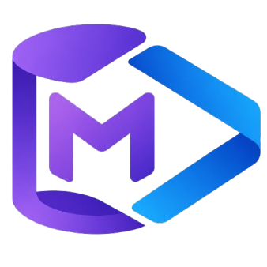
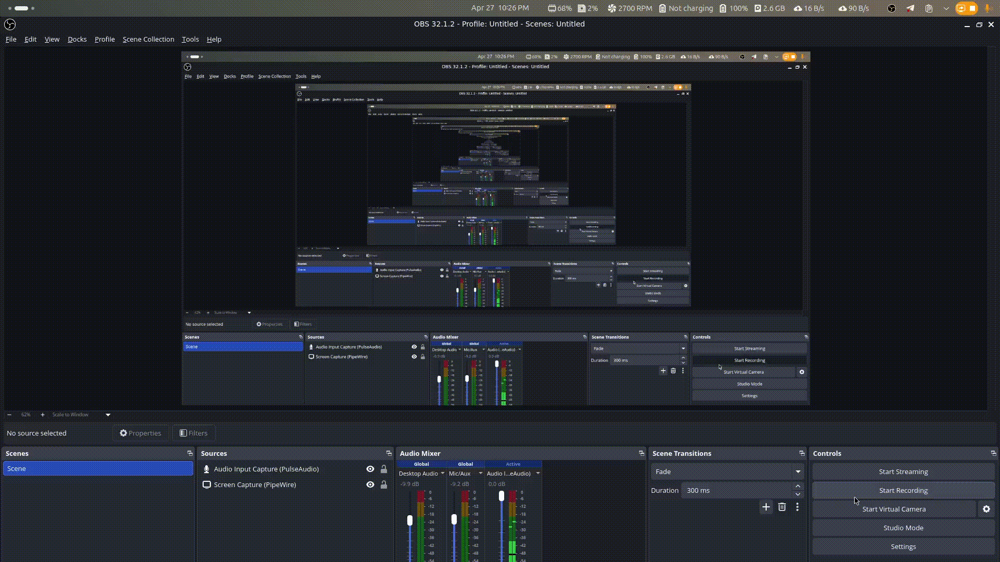
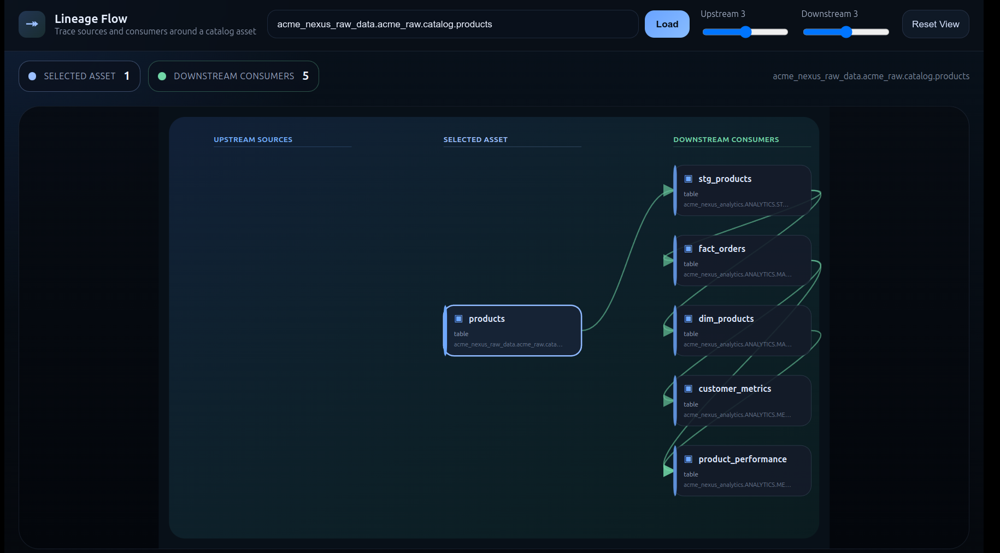
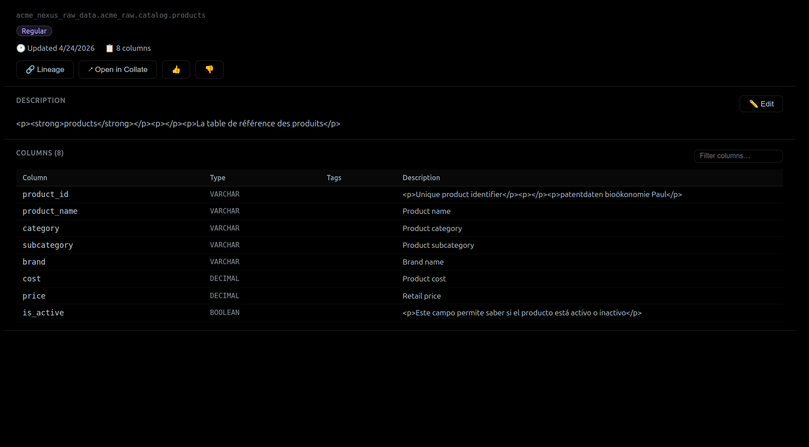
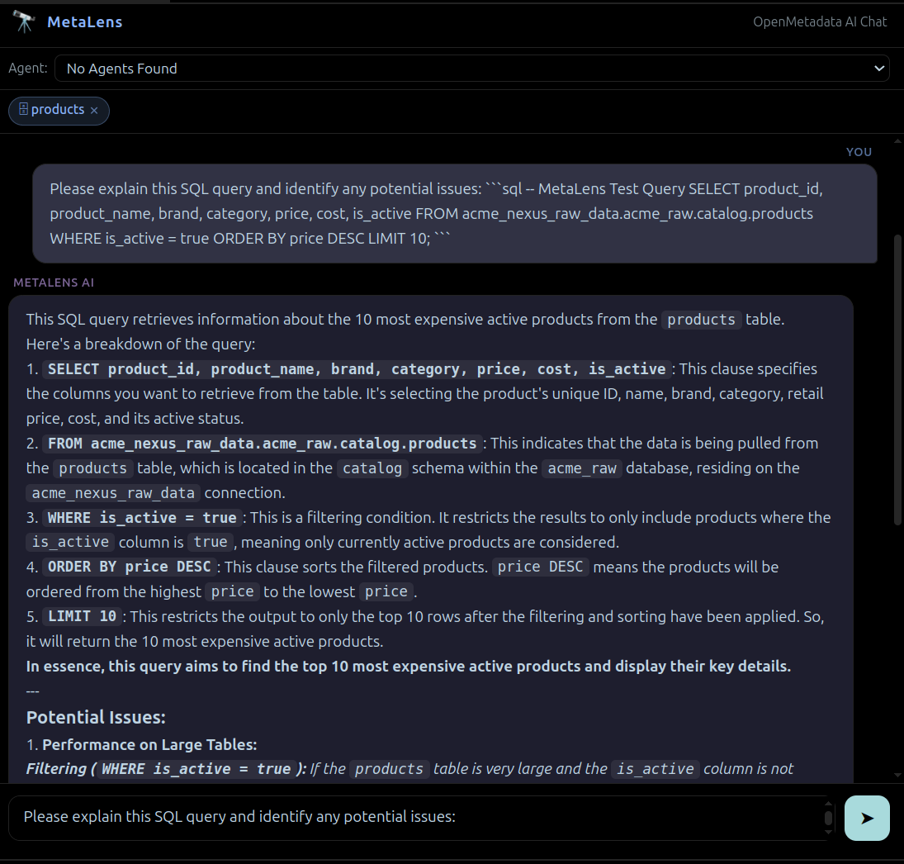
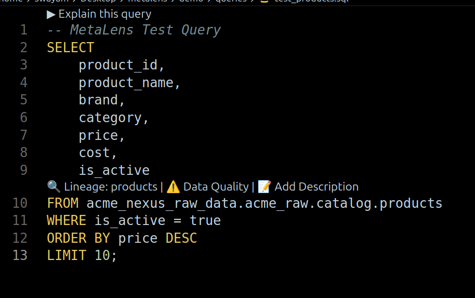
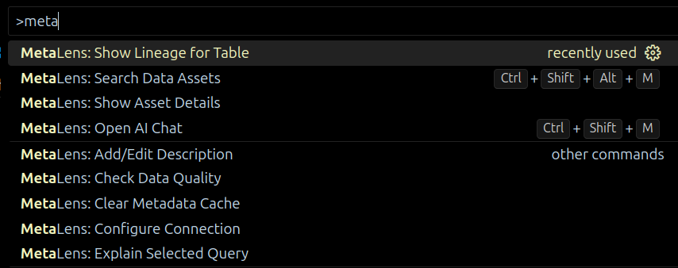

# MetaLens - Bringing OpenMetadata to your IDE

<a href="https://github.com/swymbnsl/expenBoard/">
<p align="center">
    
  </a>
<br/>
  <h3 align="center">MetaLens</h3>

<div align="center" >

[](https://github.com/swymbnsl/metalens) [](./LICENSE)

</div>
<p align="center">
    <br/>
    <a href="https://metalens.swymbnsl.com/">View Demo</a>
    .
    <a href="https://github.com/swymbnsl/metalens/issues">Report Bug</a>
    .
    <a href="https://github.com/swymbnsl/metalens/issues">Request Feature</a>
  </p>



## 📋 Table of Contents

1. [Overview](#-overview)
2. [How It Works](#-how-it-works)
3. [Features](#-features)
4. [Screenshots](#-screenshots)
5. [Prerequisites](#-prerequisites)
6. [OpenMetadata SDK](#-openmetadata-sdk)
7. [Extension Configuration](#️-extension-configuration)
8. [Core Capabilities](#️-core-capabilities)
9. [Settings Parameters](#-settings-parameters)
10. [Usage](#-usage)
11. [Diagnostics & Results](#-diagnostics--results)
12. [Troubleshooting](#-troubleshooting)
13. [Contributing](#-contributing)

## 🚀 Overview

MetaLens is a sophisticated context-aware metadata co-pilot built for VS Code that brings the full OpenMetadata/Collate semantic layer directly into your environment. It automates the process of fetching data intelligence without forcing you to switch tabs.

The tool combines the **OpenMetadata API** for metadata extraction, the **OpenMetadata AI SDK** for smart assistance, and **D3** for visual lineage graph rendering to deliver enterprise-grade metadata capabilities.

## 🔄 How It Works

MetaLens follows a structured approach to data catalog visibility:

1. **Context Acquisition**: Analyzes your active SQL, Python, or dbt file.
2. **Table Detection**: Automatically extracts table references in your code.
3. **Authentication**: Uses secure JWT tokens via VS Code SecretStorage.
4. **Metadata Fetching**: Connects to OpenMetadata to pull schema, metrics, and owner info.
5. **Rich Rendering**: Displays relevant info via Hover Cards and CodeLens actions.
6. **Diagnostic Verification**: Runs checks for internal freshness and PII elements on document save.
7. **Lineage Graphing**: Seamlessly traverses upstream/downstream dependencies.
8. **AI Chat Context**: Auto-injects found table references into an embedded AI co-pilot.
9. **Action Write-back**: Validates updates (like editing descriptions) and pushes them back via JSON Patch API.
10. **Results Delivery**: Surfaces Data Quality scores and asset insights clearly.

## ✨ Features

- **Inline Hover Cards**: Display schema, database, owner, PII-tags, freshness, and tiers instantly.
- **AI Chat Panel**: Powered by streaming from the OpenMetadata AI SDK with contextual table injection.
- **Interactive Lineage Visualization**: Zoomable up/downstream dependencies using D3 SVG graphics.
- **CodeLens Actions**: Above-query shortcuts for explainability, data quality, lineage, and editing.
- **On-Save Diagnostics**: Squiggle integrations for PII warnings and data freshness.
- **Asset Detail Panel**: Rich read/write UI panel mimicking Collate.
- **Metadata Quick Search**: Live semantic search across overall assets.
- **Secure Handling**: Connect natively with safe SecretStorage tokens.

## 📸 Screenshots

### Lineage Panel



### Asset Details Panel



### AI Chat Panel



### CodeLens Panel



### Commands Panel



## 📋 Prerequisites

### Environment Requirements

- **VS Code** (v1.85.0+)
- **OpenMetadata/Collate Server** URL host
- **Bot/Service PAT (Personal Access Token)** for authentication
- Active **Node/NPM** environment (if building from source)

### Project Requirements

- Files in format: `.sql`, `.py`, dbt YAML, Jinja-SQL
- Workspace open in VS Code

## 🔧 OpenMetadata SDK

MetaLens utilizes the following API endpoints and plugins:

### Core Endpoints

- `GET /api/v1/search/query` - Assets resolving
- `GET /api/v1/tables/name/{fqn}` - Extract table features
- `GET /api/v1/lineage/table/name/{fqn}` - Structural connectivity
- `PATCH /api/v1/tables/{id}` - Modification payloads
- `GET /api/v1/dataQuality/testCases` - Validation tasks

### AI SDK Integrations

- `@openmetadata/ai-sdk` - Connect to agent apps
- Streaming responses for standard model generations

## ⚙️ Extension Configuration

The tool runs a fast setup with zero pain points:

### Connection Settings

- **Namespace**: `MetaLens: Configure Connection`
- **Purpose**: Securely walk through host, token, and agent choices over wizard form.
- **Key Tasks**: Storing keys, caching instance URIs.

## 🌪️ Core Capabilities

### 1. **Inline Investigation**

- Hovers text to expose OpenMetadata stats.
- Configurable domain and ownership layers.
- Validates data boundaries easily.

### 2. **Contextual GenAI Assistant**

- Pre-seeded AI Studio agent interaction limitlessly in VS Code.
- Configurable prompt types (`AskCollateAgent`, etc)
- Extends standard explainability directly in editor.

### 3. **Lineage Analysis**

- Introduces complete tracking logic visually.
- Configurable depth scanning (1-5 layers).
- Tests data source roots interactively.

### 4. **Bi-directional Integration**

- Write operations allowing asset modifications locally.
- Easy rating triggers like upvote/downvote structures.
- Direct JSON patching.

## 📝 Settings Parameters

### Workspace Settings

| Parameter                    | Type    | Description                                                    | Default             |
| ---------------------------- | ------- | -------------------------------------------------------------- | ------------------- |
| `metalens.host`              | STRING  | OpenMetadata/Collate host URL                                  | `""`                |
| `metalens.token`             | STRING  | Bot PAT (Personal Access Token) for authentication             | `""`                |
| `metalens.geminiKey`         | STRING  | Google Gemini API Key to use for OpenMetadata MCP integrations | `""`                |
| `metalens.defaultAgent`      | SELECT  | Default AI Studio agent                                        | `"AskCollateAgent"` |
| `metalens.onSaveSuggestions` | BOOLEAN | Enable on-save metadata detection                              | `true`              |
| `metalens.piiDiagnostics`    | BOOLEAN | Enable PII diagnostic warnings                                 | `true`              |
| `metalens.cacheSeconds`      | INT     | Metadata cache TTL in seconds                                  | `300`               |

## 🚀 Usage

### 1. Installation Execution

```bash
# General setup
code --install-extension metalens-0.1.0.vsix
```

### 2. Configure Connection

```yaml
# Open the Command Palette (Ctrl+Shift+P) and run:
MetaLens: Configure Connection

# Insert Requirements:
1. OpenMetadata URL
2. PAT (Personal Access Token)
3. Gemini Key
```

### 3. Execution Commands

- `MetaLens: Open AI Chat`
- `MetaLens: Search Data Assets`
- `MetaLens: Clear Metadata Cache`

## 📊 Diagnostics & Results

### On-Save Validations

MetaLens evaluates the following heuristics on file save:

- **PII Integrity**: Shows yellow diagnostic warnings if columns hold PII.
- **Freshness Validity**: Info-flags instances where data hasn't seen updates cleanly.
- **Extraction Rate**: Status bar logs detected metadata footprints.

### Diagnostics Criteria

Alerts are mapped functionally inside your file boundaries:

```bash
✅ PASSED: Data freshness updated under 7 days AND No PII tags
⚠️ FAILED: Older data timestamps OR Found PII tags flag squiggle lines
```

## 🔧 Troubleshooting

### Common Issues

#### 1. Connection Failures

```bash
# Check your host format matches standard urls (e.g. https://your-org.getcollate.io)
# Ensure API keys are active
```

#### 2. Hover Cards Missing

```bash
# Verify MetaLens recognizes your file type (.py, .sql, .yml)
# Refresh cache via `MetaLens: Clear Metadata Cache` command
```

### Debug Commands

```bash
# Trigger re-lint
Ctrl+S across editor

# View full logs via output panel
Output -> MetaLens
```

## 🤝 Contributing

We welcome contributions to MetaLens! Please follow these guidelines:

1. **Fork** the repository
2. **Create** a feature branch
3. **Implement** your changes
4. **Test** thoroughly (`npm test`)
5. **Submit** a pull request

### Development Setup

```bash
# Clone repository
git clone https://github.com/swymbnsl/metalens.git

# Install dependencies
npm install

# Build everything
npm run build:all

# Run unit tests
npm test
```

---

## 📄 License

This project is licensed under the MIT License - see the [LICENSE](LICENSE) file for details.

## 🙏 Acknowledgments

- **OpenMetadata** team for the excellent data cataloging standard
- **D3.js** community for graphical mapping
- **VS Code Extension API** documentation

---

**MetaLens**: Your data catalog, right where you code! ��
